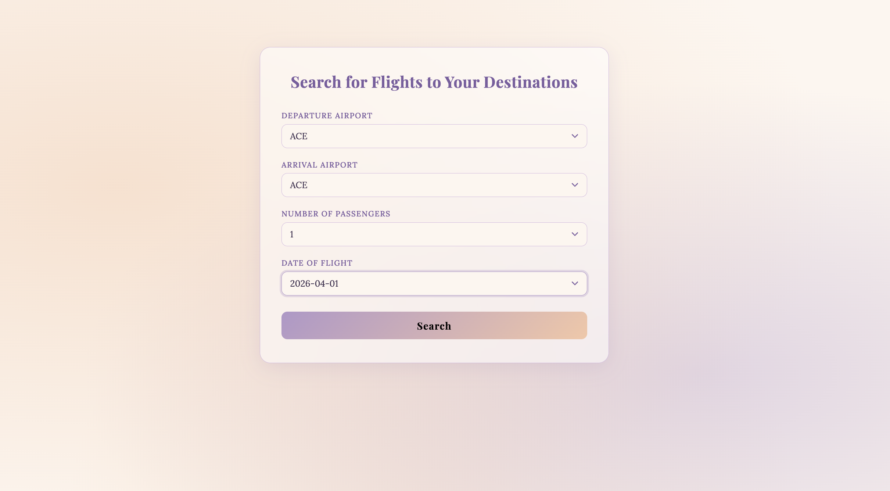
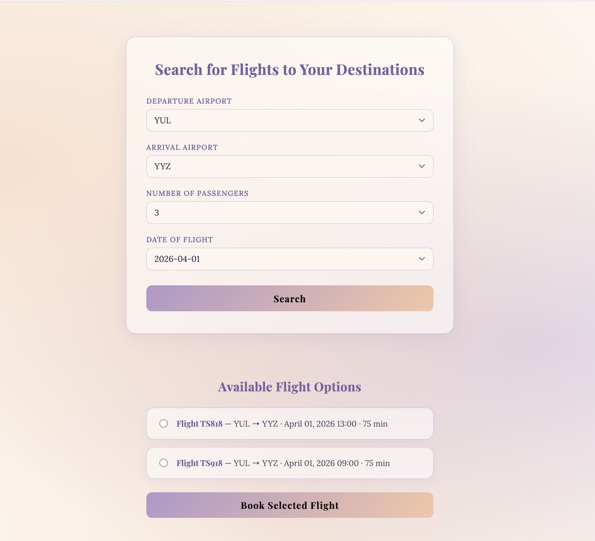
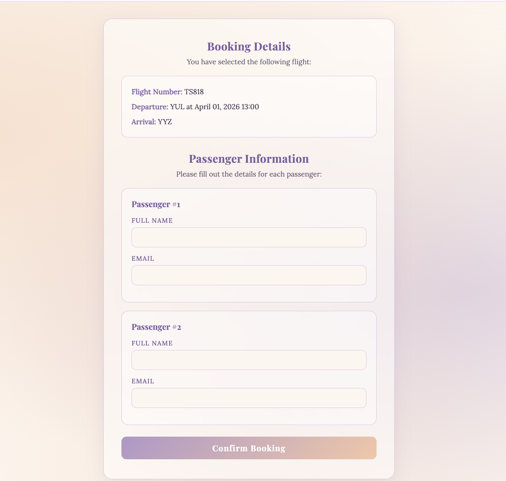
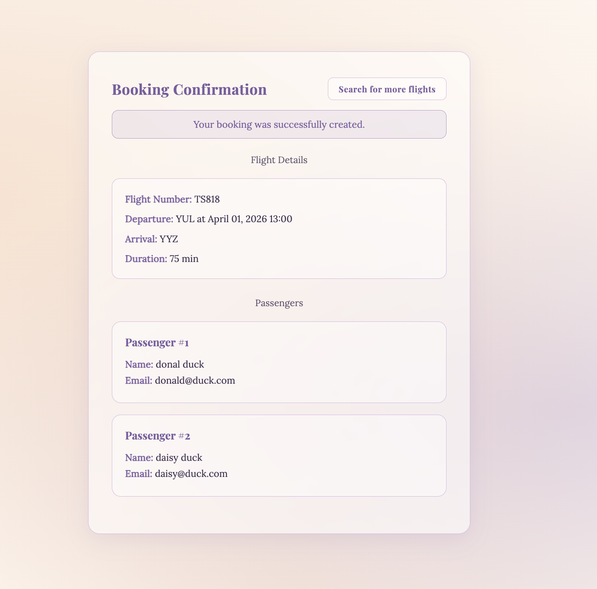

# Odin Flight Booker

## Description

Odin Flight Booker is a Rails application built as part of The Odin Project curriculum. The app allows users to search for flights between airports, select a flight, and book it for one or more passengers — similar to a simplified version of Google Flights.

## 🌟 Demo

Watch the demo video to see the app in action: [Odin Flight Booker Demo](https://www.loom.com/share/3e2f8fa976884aa99d194c1f74eccd6d)

## Getting Started

- Clone the repository

```bash
git clone https://github.com/keshiacor/rails-flight-booker.git
```

- Navigate into the project directory

```bash
cd rails-flight-booker
```

- Install Ruby gems

```bash
bundle install
```

- Run the database migrations to set up the database schema

```bash
bin/rails db:migrate
```

- Seed the database with airports and flights

```bash
bin/rails db:seed
```

- Start the Rails server

```bash
bin/rails server
```

- Open the app in your browser

Visit `http://localhost:3000` to start searching for and booking flights.
To view the list of available flights, see [availableFlights.md](availableFlights.md) so you can use the correct departure and arrival airport codes along with the date when searching for flights in the app faster.

## Technologies

- Ruby on Rails 8.1 – Web framework used to build the application.
- SQLite3 – Default development and test database.
- Propshaft – Asset pipeline for serving stylesheets and JavaScript.

## Features

- Users can search for flights by selecting a departure airport, arrival airport, number of passengers, and date.
- Search results display available flights with flight number, route, departure time, and duration.
- Users can select a flight and proceed to the booking form.
- The booking form dynamically renders passenger fields based on the selected passenger count.
- Users enter a name and email for each passenger on the booking.
- Upon successful booking, users are redirected to a confirmation page showing flight and passenger details.
- Users can navigate back to the search page to book additional flights.

## Usage

Flight search page


Search results with available flights


Passenger booking form


Booking confirmation page


## Important Dependencies

- Propshaft – Modern asset pipeline for Rails.
- Importmap – JavaScript module management without bundling.
